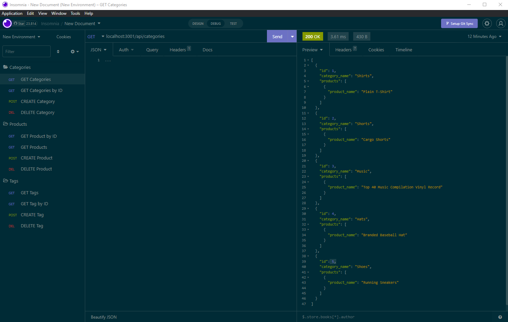
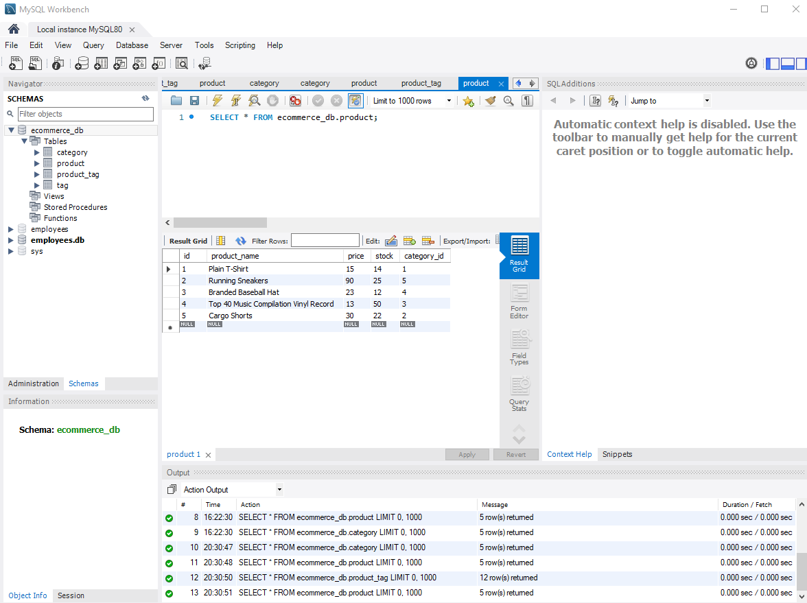

# <E-Commerce-BackEnd->

## Description

In this project I Built the backend to an e commerce website that you can actively change the data in the database. My motivation for this project was to challange myself to build the backend to a website that is part of the the largest sector in the electronics industry. One thing I learned while doing this project is how to seed the data into the database.

## Table of Contents (Optional)


- [Installation](#installation)
- [Usage](#usage)
- [Credits](#credits)
- [License](#license)

## Installation

Copy the Repository from https://github.com/DylanB0905/eCommerce-BackEnd.
Start server by typing either node server.js or npm run start.
Seed the data to the database by typing npm run seed.

## Usage

    ```md
    

    ```


    ```md
    
    ```

## Credits
Starter Code from University of New Hampshire Web Development BootCamp
MySQL: https://dev.mysql.com/doc/
Express.js: https://expressjs.com/

## License

MIT

## Test
Video of test: https://youtu.be/3TlmKffdk6A

## How to Contribute

The [Contributor Covenant](https://www.contributor-covenant.org/)
